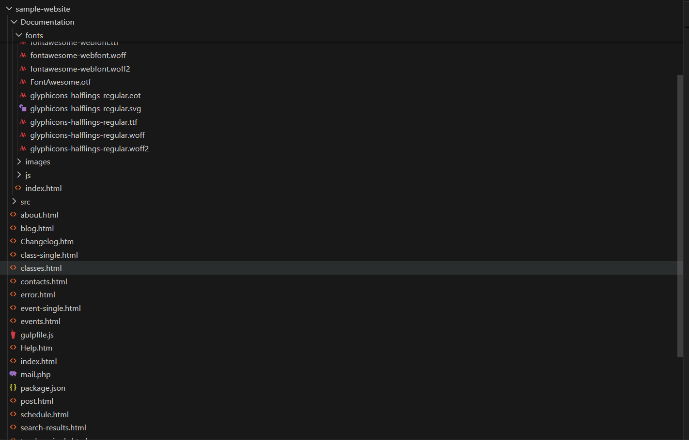
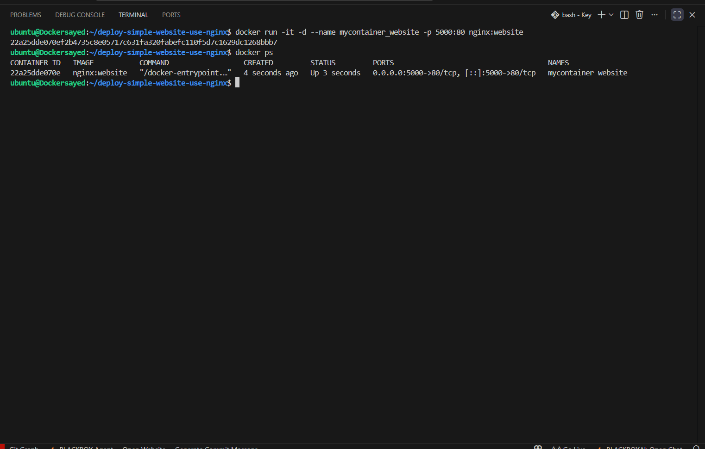
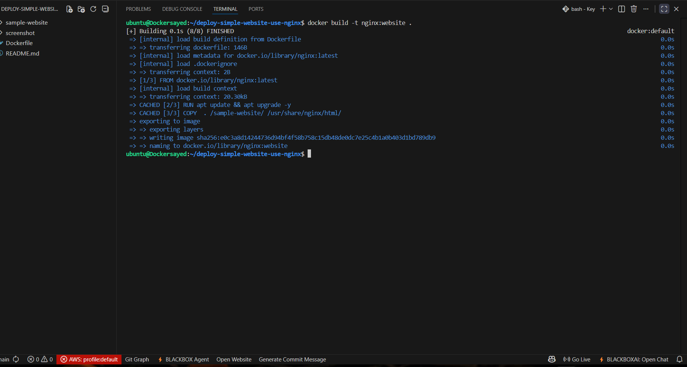
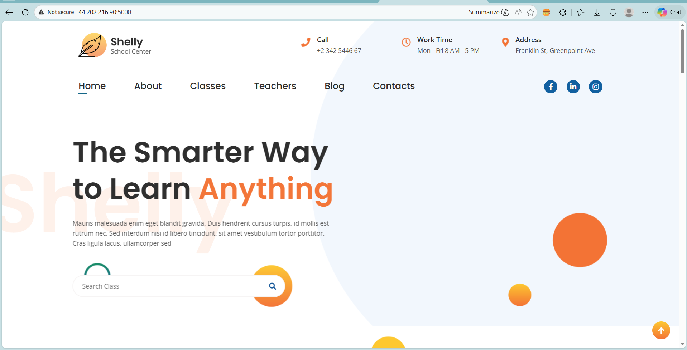

# 🚀 Deploy Simple Website Using NGINX

## 📌 Project Idea
This project demonstrates how to run a simple static HTML/CSS website inside a *Docker container* using *Nginx* as a web server.  
The project shows how to build the Docker image, run the container, and verify the deployment with screenshots.  
It also demonstrates how Nginx serves static content efficiently.

---

## 📂 Project Structure
- *sample-website/index.html* → The main HTML web page file.
- *Dockerfile* → Instructions for building the Docker image with Nginx.
- *sample-website/screenshot/* → Step-by-step visual documentation.

---

## 🛠 How It Works
1. Create a basic HTML/CSS page inside `sample-website/index.html`.
2. Use a Dockerfile to copy the HTML files into an Nginx container.
3. Build and run the container, exposing it to a specific port (e.g., 8080).
4. Access the page via a web browser using `http://localhost:8080`.
5. Update the HTML file to change the displayed content and re-deploy if needed.

> *Note:* The HTML code is located in (sample-website/index.html).

---

## 📸 Screenshots

### 1️⃣ Project Code
  
Shows the static website code and Dockerfile setup.

---

### 2️⃣ Creating the Container
  
Container creation and running details.

---

### 3️⃣ Building NGINX Image
  
Docker image successfully built for Nginx.

---

### 4️⃣ Browser Test
  
The website displayed successfully after running the container.

---

## ✅ Result
A static HTML/CSS website was successfully hosted inside a Docker container using Nginx, with the ability to quickly update and view changes in real-time.

----

## 👤 Author

Name : Sayed Atwh Sayed

GitHub: https://github.com/SayedAtwh/

LinkedIn: www.linkedin.com/in/sayed-atwh-sayed

Email : sayed.atwh.sayed@gmail.com

---

## 📜 License
This project is licensed under the MIT License - see the [LICENSE](LICENSE) file for details.
